# project-lab2-udacity-ThaiNS1

1. link web
http://udaci-webse-dl79q6jjsxc8-994722410.us-east-1.elb.amazonaws.com/

2. the command to create stacks
aws cloudformation create-stack --stack-name udacity-network \
    --template-body file://network.yml   \
    --parameters file://network-parameters.json  \
    --region=us-east-1

aws cloudformation create-stack --stack-name udacity-udagram \
    --template-body file://udagram.yml   \
    --parameters file://udagram-parameters.json  \
    --region us-east-1 \
    --capabilities CAPABILITY_IAM

3. Infrastructure Diagram
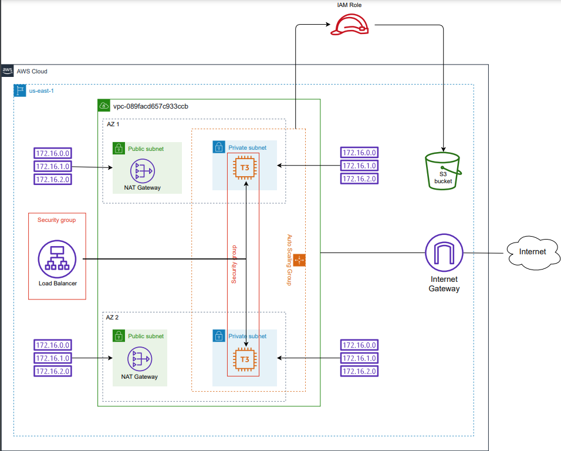

create 2 stacks for network-infra and udagram-infra:
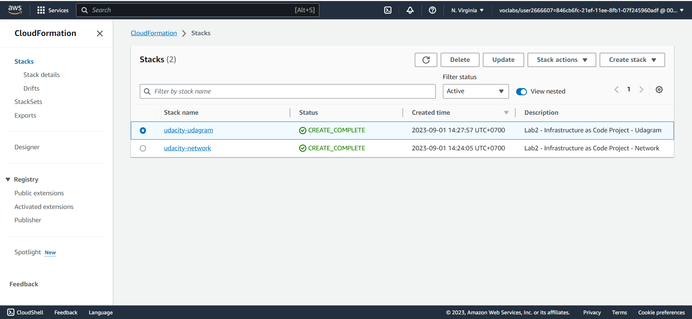

4. Parameters
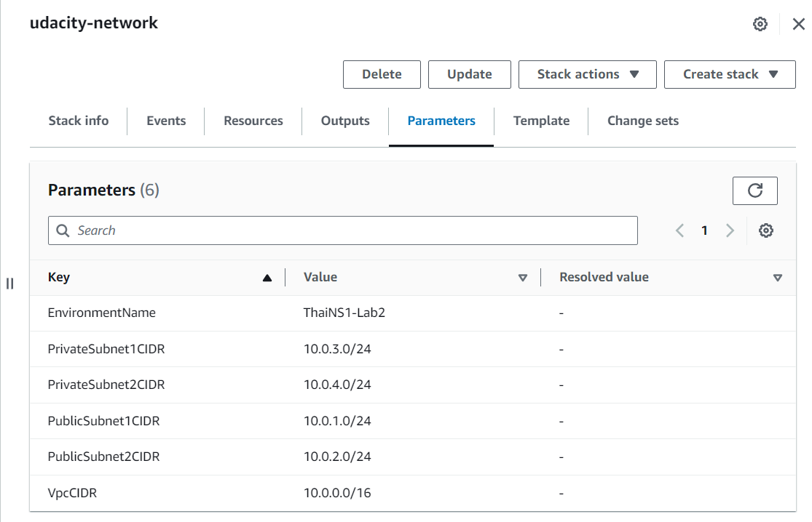
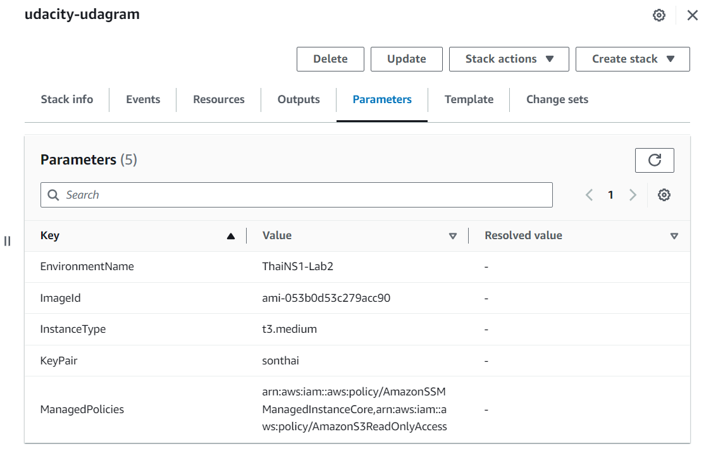

5. Security Groups
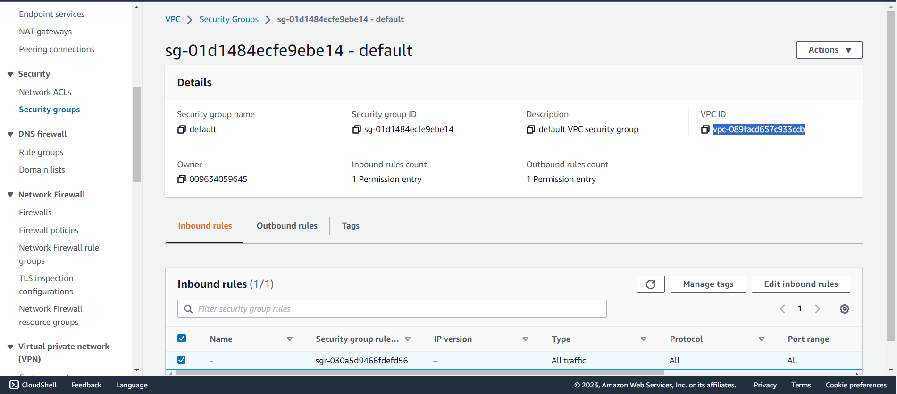

6. Resources
-LoadBalancer:
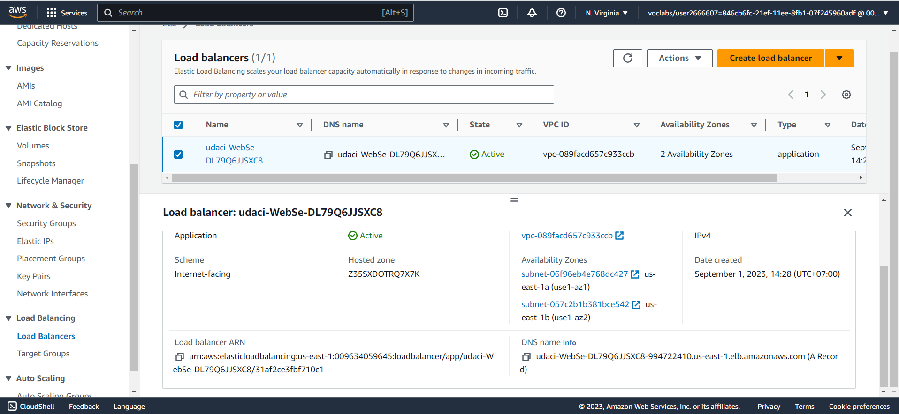
-Launch Template:
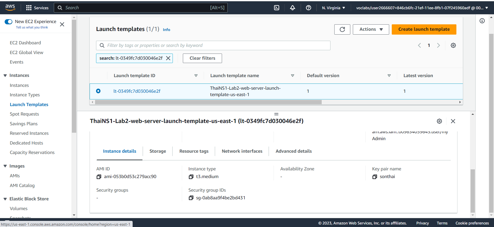
-AutoScaling group a health check:
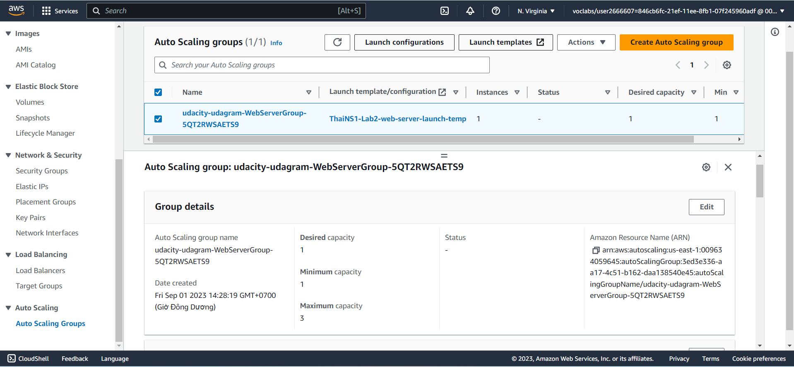
-The Load Balancer will have a Listener rule associated with the same target group:
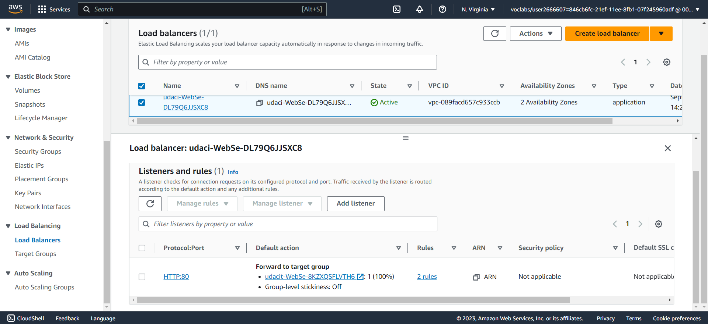
-Port 80 should be used in Security groups, health checks and listeners associated with the load balancer:
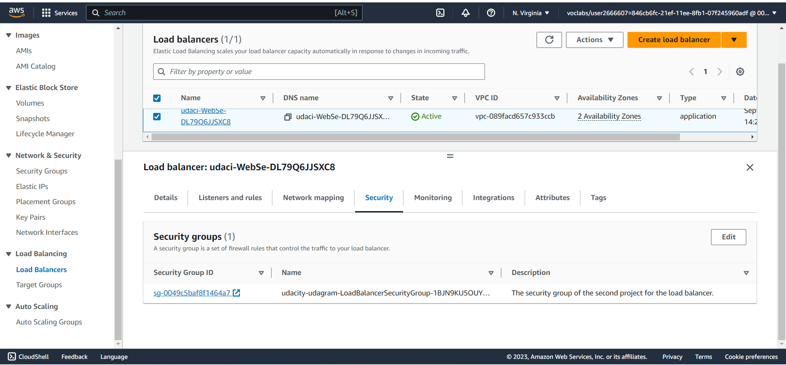
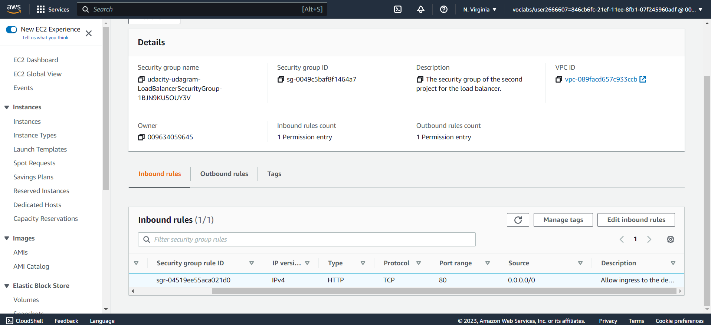
-Auto-Scaling should be using PRIV-NET ( private subnets ) for their auto-scaling instances:
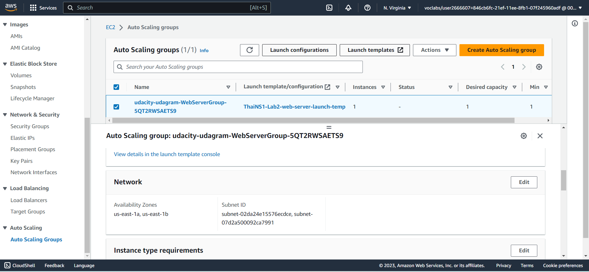
-Instance, The machine should have 10 GB or more of disk and should be a t3.small or better (Here is T3.medium)
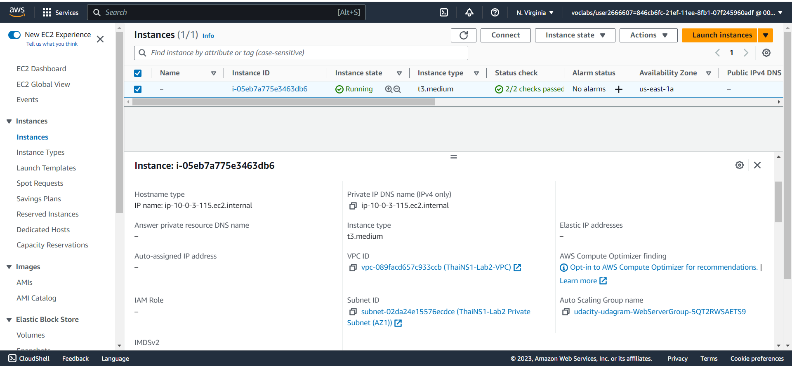
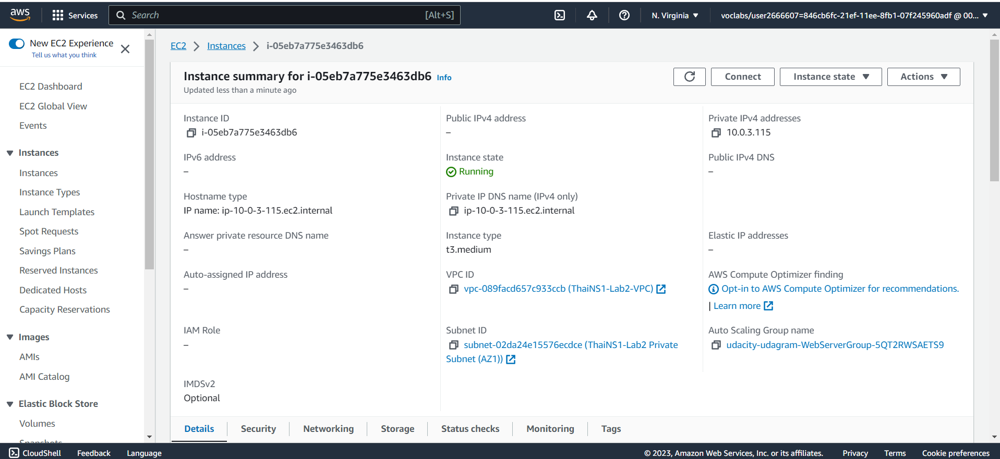
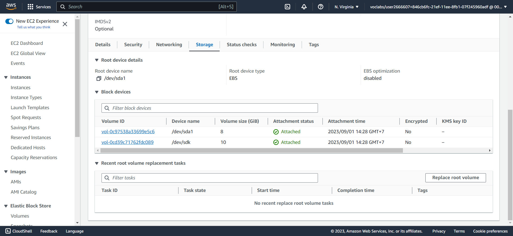

7. Outputs:
http://udaci-webse-dl79q6jjsxc8-994722410.us-east-1.elb.amazonaws.com/
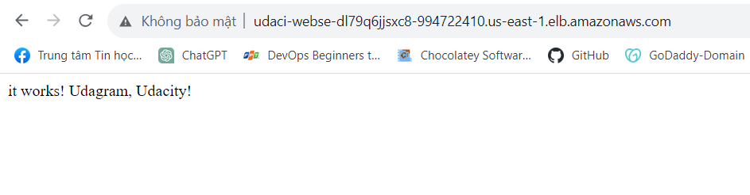